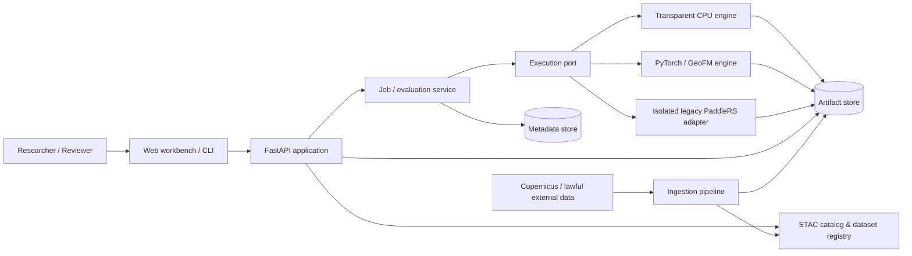
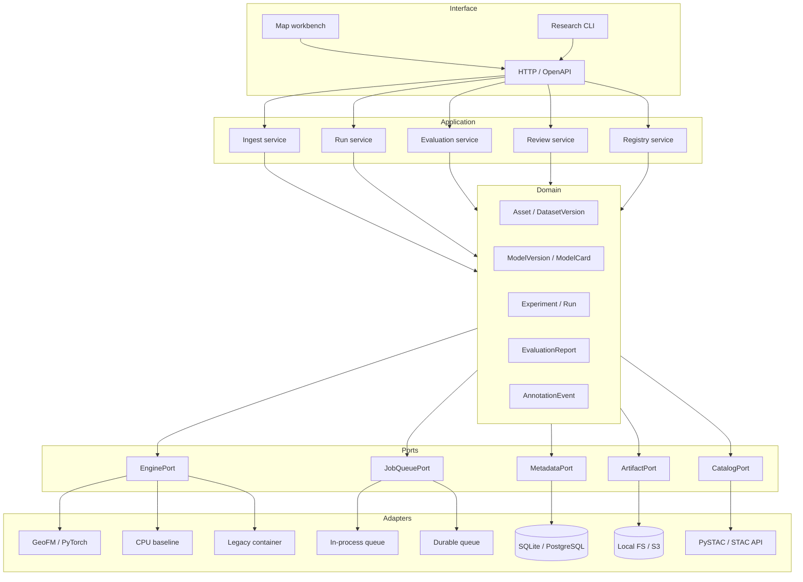

# I2RSI V2 架构

> Architecture for a reproducible, geospatially correct and research-grade GeoAI workbench

- 状态：目标架构 + 当前实现盘点
- 版本：2026-08-31
- 相关研究设计：[RESEARCH_BLUEPRINT.md](./RESEARCH_BLUEPRINT.md)

## 1. 架构结论

I2RSI V2 采用“**研究契约优先的模块化单体 + 可替换执行适配器**”：先在一台研究工作站上把数据、作业、评测和 provenance 做正确，再在确有并发需求时拆出队列、GPU worker、对象存储和数据库。微服务不是研究贡献，也不是首版前提。

五条不可妥协的边界：

1. **推理与评测分离。** 无真值的 run 只产生预测统计；mIoU/F1/mAP 等只能由绑定数据版本与真值的 evaluation 产生。
2. **地理信息端到端保真。** CRS、affine transform、GSD、footprint、时相和 NoData 不得因转成 PNG 而丢失。
3. **run 是不可变证据。** 输入、代码、模型、配置和产物都有版本/哈希；修订生成新版本，不覆盖历史。
4. **算法通过端口接入。** 透明 CPU 基线、旧 PaddleRS、PyTorch/GeoFM 或 ONNX 都实现同一 engine contract，不渗入 API/界面。
5. **legacy 被隔离而非伪装升级。** 旧 Flask 全局状态与共享目录不能进入 V2 进程；迁移适配器只能以受限子进程/容器调用。

目标质量属性按优先级排序：scientific validity > reproducibility > geospatial correctness > failure isolation > security > usability > throughput > horizontal scale。

## 2. 当前仓库：事实快照

### 2.1 Legacy（2022/2023 路径）

| 层 | 文件/做法 | 主要问题 |
| --- | --- | --- |
| Web | `process.py` + Flask，`webpage/*.html` | 路由、全局状态、文件 IO、模型加载和报告生成耦合；不支持多用户隔离 |
| 算法 | `functions/*.py` 直接调用 PaddleRS/OpenCV | 输入输出没有稳定 schema；模型/预处理版本难追踪 |
| 状态 | `pro`、`model`、`score` 等模块级变量 | 并发请求会互相覆盖；重启后状态消失 |
| 产物 | 固定写入 `webpage/res` | 作业间覆盖，无法形成不可变证据链 |
| 模型 | `weights/weights.db` + 本地目录/压缩包 | registry 与运行时强耦合；缺少权重哈希、许可与结构化 model card |
| 客户端 | `webstart.py` + pywebview，Windows `.bat` | 环境依赖陈旧、平台绑定、部署不可验证 |
| 在线输入 | 服务端 `urlretrieve` 用户提供 URL | 存在 SSRF、超大下载与协议滥用风险；V2 不继承此行为 |

Legacy 仅作为历史实现和回归参照。`README.md` 中的旧部署方式、旧权重与网页指标不定义 V2 contract。

### 2.2 V2 seed（当前已实现）

| 能力 | 当前实现 | 状态/边界 |
| --- | --- | --- |
| API | `i2rsi/app.py` 的 FastAPI `/api/v1` | 已实现基础健康检查、模型/场景、创建/查询作业；不是 OGC API conformance 声明 |
| Domain DTO | `i2rsi/models.py` 的 `TaskType`、`ModelCard`、`JobManifest` | 已有类型边界；尚无 DatasetVersion、Evaluation、AnnotationEvent |
| Application service | `i2rsi/service.py` 的 `JobService` | 每个 job 独立目录、原子 manifest 替换；内存索引 + 本地 JSON 仅适合单进程 |
| Engine | `i2rsi/engine.py` 的透明 CPU baselines | 可运行、确定性、无旧权重依赖；是产品/链路 baseline，不是训练模型或精度基线 |
| Registry | `i2rsi/registry.py` 中代码内 model cards/scenarios | 能表达限制；尚不能版本化、签名或动态审批 |
| Storage | `artifacts/v2/jobs/<job_id>` | 输入与输出按 job 隔离并有 SHA-256；没有事务数据库、授权和对象生命周期策略 |
| Frontend | `i2rsi/static/` 研究工作台 | 可展示 run statistics、图层和 claim boundary；目前仍是图像/像素空间，不是 GIS 地图客户端 |
| Security | 上传大小限制、文件名净化、安全响应头 | 尚缺文件类型魔数/解码预检、鉴权、配额、恶意文件扫描与 tenant 隔离 |
| Tests | `tests/` API/作业/产物契约 | 覆盖诚实指标、哈希和隔离；尚缺真实 GeoTIFF round-trip、队列恢复和科学指标 golden tests |

当前 `BackgroundTasks` 在 API 进程内执行，`_jobs` 是进程内索引。它能够支撑本地 demo，但不具备持久队列语义：服务退出时的任务会失败，多个 API worker 也不会共享一致状态。当前引擎会缩放 RGB 图并输出像素坐标 GeoJSON，因此不得宣称保留真实地理坐标。

## 3. 系统上下文与目标边界



### 控制平面与数据平面

- **控制平面：** catalog metadata、dataset/model cards、experiment configs、job/evaluation states、annotation events、访问控制和审计日志；小对象、可查询、事务一致。
- **数据平面：** COG、GeoJSON/GeoParquet、标签、权重、日志与报告；大对象、内容寻址、流式访问、不可变。
- API 返回资源链接和摘要，不把大影像或权重塞进 metadata 数据库。

## 4. 目标逻辑架构



依赖方向只能由外向内：interface/adapters 依赖 application/domain；domain 不导入 FastAPI、Rasterio、PaddleRS、PyTorch、数据库客户端或浏览器概念。

建议的最终包结构如下；这是迁移目标，不要求一次重排当前 seed：

```text
i2rsi/
  api/                 # routers, request/response schemas, auth dependencies
  application/         # ingest/run/evaluate/review use cases
  domain/              # immutable entities, policies, ports, errors
  adapters/
    catalog/           # STAC 1.1 / PySTAC
    geospatial/        # rasterio/GDAL, COG, CRS, vector conversion
    engines/           # cpu, geofm, onnx, isolated legacy
    jobs/              # local executor, durable queue
    metadata/          # SQLite, PostgreSQL
    artifacts/         # local filesystem, S3-compatible
  research/            # splits, metrics, calibration, experiment runner
  static/              # map workbench; no scientific business rules
```

## 5. 核心领域模型

### 5.1 实体与不可变标识

| 实体 | 主键 | 必须固定的内容 |
| --- | --- | --- |
| `Asset` | `asset_id@version` 或内容哈希 | URI、media type、roles、SHA-256、size、license、owner |
| `GeoAsset` | `asset_id@version` | CRS、transform、bbox/geometry、GSD、bands、datetime、NoData |
| `DatasetVersion` | `dataset_id@semver-or-hash` | STAC Collection/Items、label schema、split manifest、dataset card |
| `ModelVersion` | `model_id@version` | weight hash、architecture、input contract、preprocess、license、model card |
| `Experiment` | `experiment_id@version` | hypothesis、frozen config、comparison set、selection/success rules |
| `Run` | UUID/ULID | 单个训练/推理执行的完整解析配置和状态历史 |
| `Evaluation` | UUID/ULID | prediction run、ground-truth dataset version、metric suite version、report |
| `AnnotationEvent` | append-only event id | actor/pseudonym、时间、操作、geometry/label、source run、parent label version |
| `Artifact` | SHA-256 + logical id | kind、media type、size、URI、producer run、lineage |

同一名称允许有多个版本，但版本记录不可原地修改。`latest` 只能是可变别名，任何实验必须解析为具体版本后再运行。

### 5.2 三种数值必须物理分离

| 类型 | 产生者 | 示例 | 存放位置 |
| --- | --- | --- | --- |
| `RunObservation` | inference engine | `runtime_ms`、预测面积、候选数、score proxy | run manifest 的 `observations` |
| `EvaluationMetric` | evaluation service + ground truth | F1、mIoU、mAP、ECE、AURC | 独立 evaluation report |
| `ReferenceMetric` | 外部论文/model card | 某论文在特定公开协议的结果 | model card 的 `references[]`，带 URL/协议；默认不注入 run |

API、数据库与 UI 不得把三者合并为一个自由格式的 `metrics` 字典。当前 `JobManifest.metrics` 是 seed 阶段兼容字段，下一次 schema 迁移应重命名为 `observations`，并保留读取旧 manifest 的 migration adapter。

### 5.3 Run manifest 最小契约

```json
{
  "schema_version": "i2rsi.run/2.0",
  "run_id": "01...",
  "kind": "inference",
  "status": "succeeded",
  "created_at": "...",
  "started_at": "...",
  "finished_at": "...",
  "task": "change_detection",
  "dataset_version": "hk-change@sha256:...",
  "split_manifest_sha256": "...",
  "model_version": "geoadapt@sha256:...",
  "engine": {"id": "geofm-pytorch", "version": "..."},
  "code": {"git_commit": "...", "dirty": false, "container_digest": "sha256:..."},
  "inputs": [{"asset_id": "...", "role": "t1", "sha256": "..."}],
  "parameters": {"threshold": 0.62},
  "randomness": {"seed": 17, "deterministic": true, "exceptions": []},
  "environment": {"python": "...", "lock_sha256": "...", "hardware": "..."},
  "observations": {"runtime_ms": 1234.5, "predicted_change_pct": 7.8},
  "artifacts": [{"kind": "prediction", "href": "...", "sha256": "..."}],
  "lineage": {"parent_runs": [], "annotation_version": null},
  "claim_scope": "unlabelled_inference_only"
}
```

服务先写 `request.json`，状态变化写 append-only event，再原子发布 materialized `manifest.json`。失败 run 也保留请求、日志和已完成产物；错误对外净化，对内以受限日志保存 traceback。

## 6. 地理数据架构

### 6.1 标准选择

- Catalog 使用 [STAC 1.1.0](https://github.com/radiantearth/stac-spec/tree/v1.1.0) 的 Catalog/Collection/Item；STAC Item 是带时空属性和资产链接的 GeoJSON Feature。
- 栅格主产物使用 [OGC Cloud Optimized GeoTIFF 1.0](https://docs.ogc.org/is/21-026/21-026.html)，支持 overviews、tiling 与 HTTP range access；PNG/JPEG 只作 thumbnail/visual。
- 矢量结果使用 RFC 7946 GeoJSON（WGS84）或显式带 CRS 的 GeoParquet/GeoPackage。内部可以使用源 CRS，但 API 输出必须明确坐标语义。
- 计算作业语义向 [OGC API – Processes Part 1](https://docs.ogc.org/is/18-062r2/18-062r2.html) 对齐：process description、execute、job status、results；在通过官方/自建 conformance tests 前只称“OGC-aligned”。

### 6.2 Ingest invariant

每个进入 catalog 的栅格必须通过：

1. 文件签名、大小与解码检查；不信任扩展名和客户端 MIME；
2. CRS/transform/bounds/shape 一致性检查，拒绝奇异 transform；
3. band name、wavelength/common name、dtype、scale/offset、NoData 检查；
4. datetime 与时区、platform/instruments、GSD、cloud cover（可用时）检查；
5. 重投影/配准是显式派生步骤，保留 source asset，不原地覆盖；
6. COG validate、overview、checksum 和 STAC JSON Schema validate；
7. 训练切片保存源 footprint，split 按 footprint/block 生成，禁止仅按文件名随机拆分。

若输入只含普通 RGB PNG/JPEG，必须标记 `crs=null`、`coordinate_space=pixel`；UI 隐藏地图距离/面积工具，面积只能报告像素或比例，不得换算平方米。

### 6.3 数据与产物目录

```text
store/
  catalog/
    catalog.json
    collections/<dataset-version>/collection.json
    items/<item-id>.json
  datasets/<dataset-id>/<version>/
    card.yaml
    splits/<split-id>.parquet
  models/<model-id>/<version>/
    model-card.yaml
    weights-or-reference.json
  experiments/<experiment-id>/<version>/
    config.yaml
    preregistration.yaml
  runs/<run-id>/
    request.json
    events.jsonl
    manifest.json
    inputs/                 # local mode may link/copy; never user filename as path
    outputs/
    logs/
  evaluations/<evaluation-id>/
    request.json
    report.json
    tables/
    figures/
  annotations/<dataset-id>/<version>/
    events.jsonl
    snapshot.geojson
```

本地模式用文件系统 + SQLite；研究服务模式用 S3-compatible object store + PostgreSQL。两者实现相同 ports 和契约测试。

## 7. 作业、推理与评测

### 7.1 状态机

```text
accepted -> queued -> running -> succeeded
                           \-> failed
accepted/queued/running ------> cancelled
```

- 客户端 `POST` 使用 idempotency key，防止重试重复创建昂贵任务。
- 状态转换使用 compare-and-set/事务；worker heartbeat 与 lease 负责僵尸任务恢复。
- 取消是显式状态，不通过删除目录伪装；删除/保留按 retention policy 单独执行。
- 内部状态映射到 OGC 的 `accepted/running/successful/failed/dismissed`，但内部 schema 不依赖标准的拼写。

### 7.2 推理流程

1. API 校验请求并把 dataset/model alias 解析为固定版本；
2. 创建 run 与 immutable request；OGC-aligned 异步接口返回 `201 Created + Location`，当前同步 demo API 作为兼容层；
3. worker 获取 lease，验证 asset/weight hash 和 engine input contract；
4. geospatial adapter 按窗口读取 COG、保留 transform，并处理显式对齐策略；
5. engine 产生 logits/scores、prediction 与运行观测，不计算 ground-truth metric；
6. artifact adapter 写临时对象、计算 hash、原子发布；
7. manifest 汇总 lineage，job 转为 succeeded；前端按 job id 拉取或订阅状态。

### 7.3 评测流程

1. `EvaluationRequest` 必须引用 succeeded prediction run、不可变 ground-truth dataset、split manifest 和 metric suite version；
2. 评测服务检查 CRS、extent、resolution、label schema 和 ignore mask；不允许静默 resize 真值；
3. metric implementation 通过 synthetic golden tests 后运行，并输出 per-scene/per-class 明细；
4. bootstrap/CI 以空间 scene/block 为单位；报告 seed 聚合与所有原始结果；
5. report 生成 machine-readable JSON、长表和图，链接到 source runs；
6. UI 只在 `evaluation_id` 存在时渲染 `EVALUATION (GT)` 指标。

### 7.4 人工修订流程

- `ReviewQueue` 由 calibration/OOD/acquisition policy 产生，保存 policy version 和排序分数。
- 每次 polygon/brush/label 操作写 append-only `AnnotationEvent`；撤销也是事件，不直接删历史。
- 修订结果生成新的 annotation/dataset version，记录 parent 与 source run。
- 测试集默认只读，review UI 不展示模型输出给盲标者；任何 test correction 都使原 evaluation 失效并产生新版本。
- 人工效率指标来自 interaction telemetry 的匿名聚合；原始身份信息不进入公开 artifact。

## 8. EnginePort 与模型接入

建议接口概念如下：

```python
class EnginePort(Protocol):
    def describe(self) -> EngineDescriptor: ...
    def validate(self, request: ResolvedRunRequest) -> ValidationReport: ...
    def execute(self, request: ResolvedRunRequest, workspace: Path) -> EngineResult: ...
```

`EngineDescriptor` 固定 task、modalities、band order、spatial/temporal constraints、preprocess version、output schema、device needs 与 determinism。`EngineResult` 返回 artifact descriptors 和 observations，不直接返回 FastAPI response 或写数据库。

### 适配器优先级

1. `TransparentCpuEngine`：持续保留，用于 API、产物和可复现链路的无权重 smoke test。
2. `GeoFmTorchEngine`：接 Prithvi/CROMA/TerraMind 等；每个具体模型使用独立 model adapter，不写“万能波段转换”。
3. `OnnxEngine`（可选）：当模型导出后用于受控推理与性能实验。
4. `LegacyPaddleEngine`：仅迁移期；受限容器、固定输入目录、禁网、只读权重和资源上限。

禁止 V2 直接 `import process` 或让新 API 调用 legacy Flask route。旧函数需要复用时，先定义 fixture/golden output，再由独立 adapter 翻译为 V2 artifact schema。

## 9. API 边界

### 9.1 当前兼容 API

`/api/v1/health`、`/models`、`/scenarios`、`/demo-assets/{id}`、`/demo-runs/{id}`、`/jobs`、`/jobs/{id}` 和 `/research/claim-boundary` 作为 V2 seed contract 保留，破坏性变化通过新 schema version 或 `/api/v2` 引入。

### 9.2 目标资源

| 资源 | 典型操作 | 说明 |
| --- | --- | --- |
| `/stac/...` | browse/search Collections/Items | 数据发现；优先采用成熟实现/库，不自创 STAC 方言 |
| `/api/v1/processes` | list/describe | 任务与 engine 能力，不等同 model registry |
| `/api/v1/jobs` | create/list | 训练、推理、预处理等异步执行 |
| `/api/v1/jobs/{id}` | status/cancel | 包含进度、时间和 results link |
| `/api/v1/jobs/{id}/results` | list artifacts | 产物摘要与授权 URL |
| `/api/v1/evaluations` | create/list | 强制 ground truth + split + metric suite |
| `/api/v1/evaluations/{id}` | report | 只在这里返回 accuracy metrics |
| `/api/v1/experiments` | register/compare | 预注册配置与 run grouping |
| `/api/v1/annotations` | append/query events | 人工修订与 label version lineage |
| `/api/v1/models` | register/approve/list versions | model card、权重 hash、stage 与审批状态 |

所有 response 带 `schema_version`。分页、筛选和排序是显式参数；错误使用稳定 code + request id，不把本机路径或 traceback 泄露给客户端。

## 10. 前端：研究工作台而非结果画廊

目标布局保持一屏完成主要研究循环：数据/时相 → task/model/config → 地图图层 → run observations → evaluation → uncertainty/review → provenance。

前端只负责呈现和交互，不能：

- 在 JavaScript 中硬编码 accuracy、论文参考分数或“完成”状态；
- 自己计算正式评测指标；
- 根据文件名猜 CRS、传感器或日期；
- 把 score 改名为 confidence probability；
- 用前端 polygon 直接覆盖正式 ground truth。

地图层采用 OpenLayers/MapLibre 等支持真实投影和瓦片的客户端；COG 可经 TiTiler/等价受控 tile service 显示，矢量从 GeoJSON/tiles 读取。对 pixel-only demo 保留现有 image viewer，但 UI 明确标出 `Pixel CRS`。

关键可访问性与状态要求：键盘可操作、颜色之外还有形状/文字编码、loading/empty/error/partial/cancelled 状态齐全、移动端至少可检查而不承诺完整标注体验。

## 11. 安全、许可与隐私

### 11.1 信任边界

- 浏览器、上传文件、远程 URL、STAC metadata、GeoTIFF metadata、模型权重和 legacy 输出全部不可信。
- 公网部署前必须有身份认证、项目/tenant 授权、job/artifact ownership、速率/存储/GPU 配额和审计。
- artifact 不通过无鉴权目录永久公开；使用授权 endpoint 或短时 signed URL。

### 11.2 必须控制

- 上传按 [OWASP File Upload Cheat Sheet](https://cheatsheetseries.owasp.org/cheatsheets/File_Upload_Cheat_Sheet.html) 做 allowlist、魔数/解码、随机服务端文件名、大小/像素/解压比限制和隔离存储。
- 禁止任意服务端 URL 下载；若以后支持远程 STAC assets，按 [OWASP SSRF Prevention](https://cheatsheetseries.owasp.org/cheatsheets/Server_Side_Request_Forgery_Prevention_Cheat_Sheet.html) 做 scheme/host/IP allowlist、DNS 重绑定防护、超时和下载上限。
- ZIP、TIFF 和模型文件在资源受限 worker 中处理，防 decompression bomb、超大维度和反序列化执行；不加载任意 pickle。
- Legacy 容器禁网、非 root、只读 rootfs、临时工作目录、CPU/RAM/time 限额。
- dataset/model card 强制 license、用途和再分发条件；来源不明的权重不能进入 approved stage。
- 香港公开案例保留必要的空间精度，敏感/个人层面的导出需聚合或禁止。

当前 security headers 是必要但不充分的第一层，不能代替上述数据与权限控制。

## 12. 可复现性与可观测性

### 12.1 必记录 provenance

- git commit、dirty flag、构建/容器 digest、依赖 lock hash；
- dataset/model/split/annotation/metric suite 的具体版本与 hash；
- 完整解析配置、seed、确定性设置及已知非确定算子；
- 硬件型号/显存、driver/runtime、开始/结束/资源用量；
- 输入/输出 artifact hash、parent runs、错误与 retry；
- claim scope 与限制。

MLflow 可作为实验浏览 adapter；它能记录 runs、参数、代码版本、metrics 和 artifacts（参见[官方 Tracking 文档](https://mlflow.org/docs/latest/tracking/)），但 I2RSI 的 manifest 是可移植的事实源，不能把核心 lineage 只留在某个外部 UI。

### 12.2 Observability

- 结构化日志包含 request/job/run id，不记录密钥、signed URL 或原始敏感 metadata；
- metrics：队列深度、状态延迟、失败类型、artifact IO、CPU/GPU/内存、p50/p95；
- tracing 跨 API → queue → worker → storage；
- scientific dashboard 与 operations dashboard 分开，防止把吞吐指标和精度指标混为一谈。

## 13. 测试与发布门

| 层级 | 必要测试 |
| --- | --- |
| Domain | 状态转换、版本解析、claim policy、不可变实体、schema migration |
| Geospatial | GeoTIFF/COG round-trip 后 CRS/transform/bounds/NoData 不变；窗口预测坐标回写正确 |
| Engine contract | 每个 adapter 的 input rejection、output schema、确定性/seed、失败清理 |
| Scientific | 手算小数组的 F1/IoU/ECE；ignore mask；class absence；空间 bootstrap；无真值路径绝不产生 accuracy |
| Data leakage | 重叠 footprint、同 scene/time/entity 跨 split、预处理统计触碰 test 的自动检查 |
| API | OpenAPI/schema、idempotency、ownership、分页、错误码、取消和 retry |
| Storage | 原子发布、hash 校验、崩溃恢复、retention、local/S3 contract parity |
| Security | path traversal、伪 MIME、超大像素、ZIP bomb fixture、SSRF allowlist、artifact 越权 |
| UI | claim scope 标签、loading/error/partial、键盘操作、无 JS 硬编码精度 |
| Reproduction | 空环境/容器一条命令运行最小实验并重建 report；结果 hash 或数值容差受控 |

发布等级：

- `demo-baseline`：链路可运行，无精度声明；当前透明 CPU models 属此级。
- `research-candidate`：完成固定验证集与 model card，但不得用于主结论。
- `benchmark-verified`：完成冻结测试协议、多 seed、CI、数据/代码/结果归档。
- `deployment-approved`：另加安全、许可、监控、负载和人工责任审批；benchmark-verified 不自动等于可部署。

## 14. V2 / Legacy 迁移策略

### Stage A：并行存活，入口切换

- `python -m i2rsi` / `i2rsi` CLI 成为默认入口；Legacy 只在显式命令下运行。
- 建立 legacy fixtures：四类任务各固定输入、旧输出和已知失败行为。
- V2 不读取/写入 `webpage/res`，也不共享 legacy 模块级状态。

### Stage B：受控适配

- 将仍有使用价值且许可清晰的 Paddle 权重登记为 `ModelVersion`；记录 SHA-256 和旧环境镜像。
- 通过隔离 `LegacyPaddleEngine` 调用，translator 把掩膜/框/score 转为 V2 artifact；所有 score 标成 proxy。
- 用 golden fixtures 比较几何与数值容差，不追求复刻旧网页的硬编码指标。

### Stage C：替代与归档

- 当 GeoFM/现代基线在同一正式协议上完成验证后，按模型卡和用例逐项替代。
- legacy 文件先标记 deprecated 并从默认镜像排除；删除需另开显式迁移任务，保留 git 历史、许可和复现说明。
- `weights.db` 只读导出后停止作为事实源；新 registry 使用版本化 metadata store。

绝不采用“大爆炸重写后直接删除旧代码”，也不把 legacy 直接 import 到 V2 来追求短期复用。

## 15. 三阶段实现路线

### V2.0：本地可信研究底座

保留模块化单体和本地文件系统，完成：schema version、observations/evaluations 分离、真实 GeoTIFF/CRS、STAC 1.1 catalog、COG 产物、evaluation service、可复现 CLI 和 map viewer。

**退出门：** 一个公开数据小样本能从 ingest → run → evaluation → report 完整重建；无真值 run 不可能展示 F1/mIoU。

### V2.1：GeoFM 与耐久执行

引入 EnginePort、至少一个 GeoFM adapter、durable queue、GPU worker、SQLite→PostgreSQL migration path、artifact storage port、experiment registry 与多 seed runner。

**退出门：** worker 重启不丢 job；相同冻结实验在另一机器可重跑；标签预算/模态/适配矩阵能由配置生成而非手工点击。

### V2.2：人机协同与可审计发布

加入 calibration/OOD、review queue、append-only annotation events、版本化 corrected labels、香港案例、auth/quota/signed artifacts、用户 pilot telemetry 与发布包。

**退出门：** 从“不确定区域”到人工修订、派生数据版本、再训练和独立评测形成闭环；所有公开 claim 都链接 evaluation artifact。

## 16. 架构决策记录（ADR backlog）

以下决策在实现前写短 ADR，不靠聊天或代码默认值决定：

1. STAC 部署采用静态 catalog、`stac-fastapi` 还是外部 STAC API；
2. COG tile delivery 采用 TiTiler/等价服务还是预生成 tiles；
3. durable queue 的具体实现及 GPU scheduling；
4. SQLite/PostgreSQL schema 与 migration 工具；
5. artifact local/S3 路径、加密、签名 URL 和 retention；
6. LoRA/adapter 权重的模型打包与许可；
7. GeoJSON/GeoParquet/GeoPackage 的矢量主格式；
8. conformal 的交换性单位、校准策略和分布漂移失效策略；
9. annotation event schema 与测试集盲标权限；
10. legacy 归档日期和可复现镜像保存范围。

每份 ADR 至少包含 context、decision、alternatives、consequences、rollback 与 evidence link。

## 17. 完成定义

I2RSI V2 不是在首页出现 “V2” 就完成。只有同时满足以下条件才达到本架构定义的 research-grade：

- 真实地理资产不丢 CRS/transform/time/bands/license；
- run/evaluation/reference 数值在 schema、API 和 UI 三层分离；
- 每条正式结果可追溯且可由冻结配置重建；
- 空间/时间泄漏有自动审计，主结论来自外域协议；
- 模型、数据、人工修订和产物均有不可变版本与 lineage；
- legacy 失败不能污染 V2 进程或其他 job；
- 本地 demo、研究工作站和未来服务部署共享 domain contracts；
- 失败案例、限制、许可与成本和正结果一起交付。
